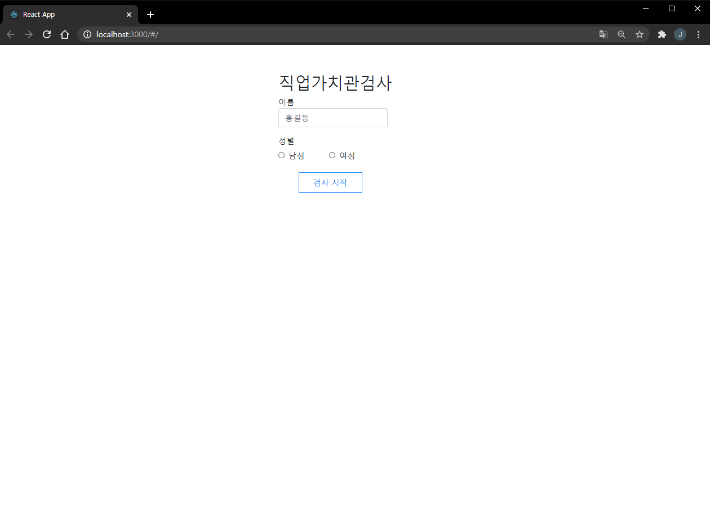
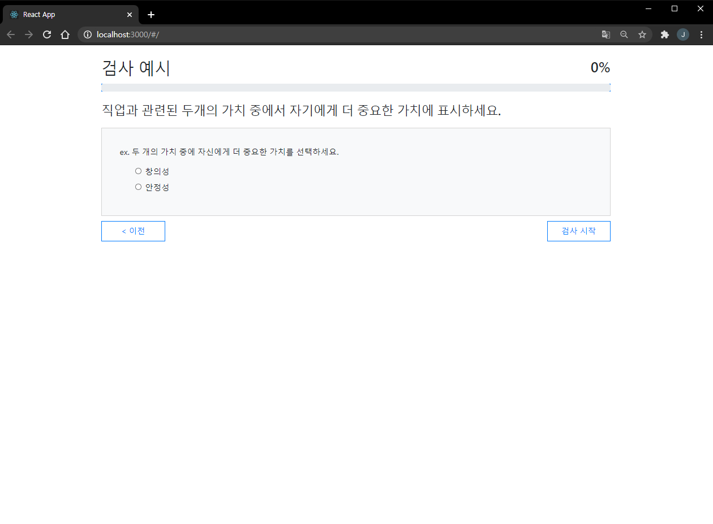
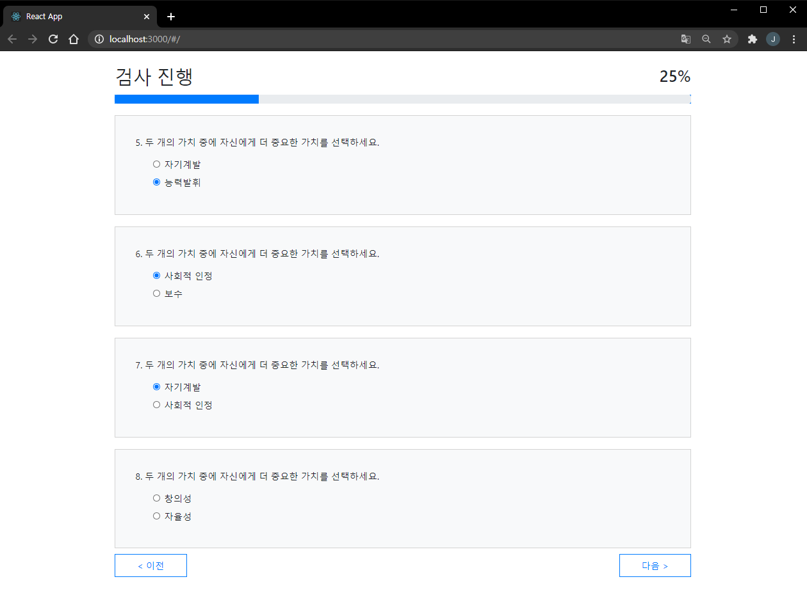
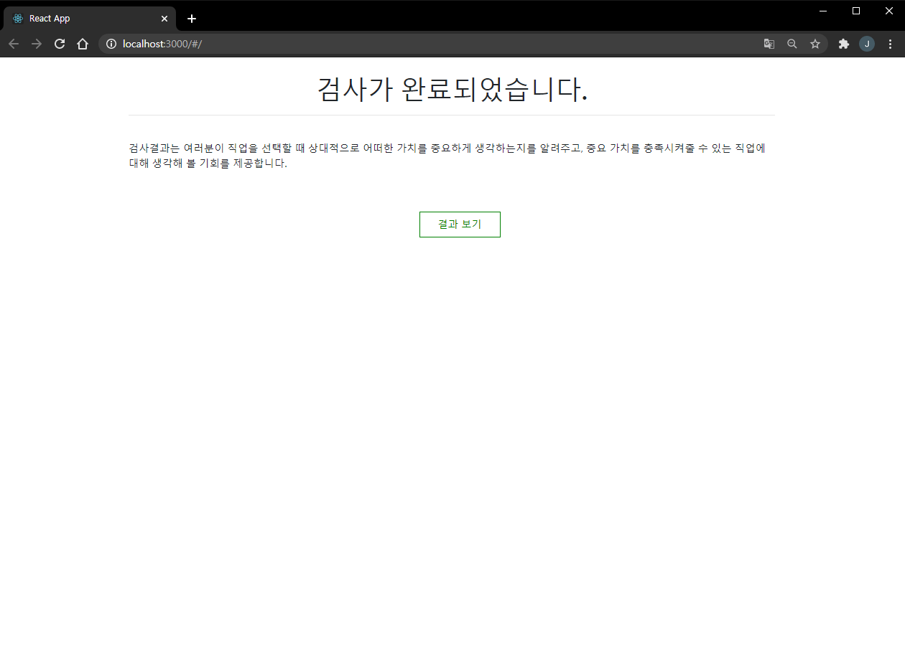
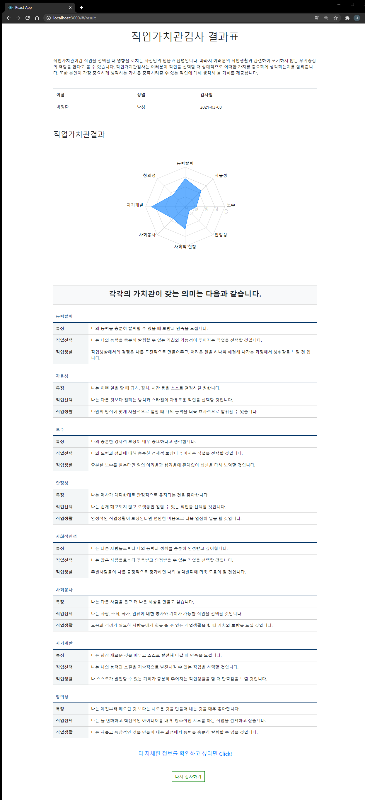
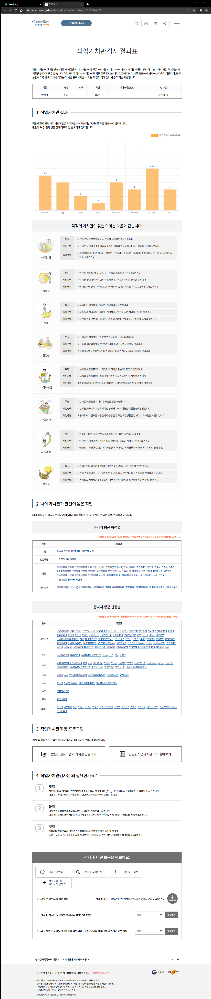

# :clipboard: ​직업 심리 검사 서비스

## 1. 프로젝트 설명

[직업심리검사 API](https://www.career.go.kr/cnet/front/openapi/openApiTestCenter.do)를 사용하여 사용자의 직업 적합도를 확인할 수 있는 웹 서비스

- `직업 가치관 검사 사이트`를 구현합니다.
- 직업 가치관 검사 사이트는 직업과 관련된 다양한 욕구 및 가치들에 대해 상대적으로 무엇을 얼마나 더 중요하게 여기는가를 살펴보고, 그 `가치가 충족될 가능성이 높은 직업을 탐색`할 수 있도록 도움을 주는 검사 사이트입니다.

## 2. 사용 API

- 심리검사 문항 요청 https://www.career.go.kr/inspct/openapi/test/questions?apikey=인증키&q=심리검사변수
- 심리검사 결과 요청 https://www.career.go.kr/inspct/openapi/test/report?apikey=인증키&qestrnSeq=심리검사변수

## 3. 기술 스택

- HTML & CSS
- Javascript
- Functional Components + Hooks
- React `17.0.1`
- bootstrap `4.6.0`
- react-router-dom `5.2.0`
- axios `0.21.1`
- recharts `2.0.8`

 
     
     
     
    
    

## 4. 페이지 소개

#### 검사자 정보 입력 페이지

- 이름을 입력할 수 있는 폼을 구현
- 성별을 선택할 수 있는 폼을 구현
- 이름 혹은 성별을 기입하지 않거나 선택하지 않을 경우 검사 시작 버튼이 비활성화 되도록 설정하였습니다.

---

### 검사 예시 페이지

- 검사를 시작하기 전 앞으로의 진행 방식에 대해서 설명하는 페이지를 구현
- 진행 방식에 대한 검사 예제 문항이 한 문항을 화면에 표시합니다.
- 검사 시작 버튼을 구현 (단, 검사 예제 문항을 수행하지 않으면 검사 시작 버튼이 비활성화 되도록 설정하였습니다.)

---

### 검사 진행 페이지

- 페이지 당 4개의 문항이 보이도록 설정하였습니다.
- 마지막 검사 진행 페이지에서는 "제출" 버튼을 띄워주고 모든 문항에 대한 응답이 완료되면 "제출" 버튼을 활성화 시켜줍니다.
- 각 문항을 응답할 때 마다 진행 표시줄과 퍼센트(%)가 갱신되도록 하였습니다.
- "이전" 버튼을 클릭했을 때에도 이전 페이지 문항에서 응답한 값이 유지되도록 하였습니다.

---

### 검사 완료 페이지

- 검사가 완료되었다는 문구를 띄우고, 결과표 페이지로 넘어갈 수 있는 "결과 보기" 버튼을 추가하였습니다.

---

### 결과표 페이지

- 검사자의 기본 정보를 출력해줍니다. (이름, 성별, 검사일)
- 직업가치관결과에 대하여 항목 별 수치를 차트 그래프를 통해 표기했습니다.
- "더 자세한 정보를 확인하고 싶다면 Click!" 문구 클릭 시 '진로정보망 커리어넷'의 결과표 페이지로 이동합니다.
- "다시 검사하기" 버튼 클릭 시, 진행했던 항목에 대한 기록은 모두 초기화시킨 후 첫 페이지로 이동합니다.

---

### 진로정보망 커리어넷 결과표 페이지

---